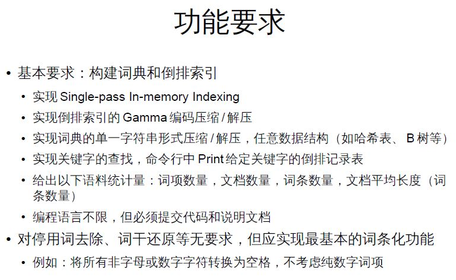

# Shakespear-Merchant
Shakespear-Merchant search engine

# reference
- [demo](https://github.com/UCAS007/informationretrieval): information retrieval code demo
- [java regex](http://regex-testdrive.com/en/): java online regex expression tool
- [jsoup](http://jsoup.org/): java html parser
- [TREC](https://github.com/UCAS007/TREC): our TREC project

# project task

- Main Class: ShakespearMerchant

./data/shakespeare-merchant.trec.1: text data input
./data/shakespeare-merchant.trec.2: text data input
./data/shakespeare-merchant.trec.1.record: standalone term-docid record output
./data/shakespeare-merchant.trec.2.record: standalone term-docid record output

./output/doc.txt: docno and docid output
./output/wordDoc.txt: term and docid output
./output/encode.txt: gama encode term-docid matrix output
./output/decode.txt: gama decode term-docid matrix output
./output/singlestr.txt: single string compression and uncompression output

- single-pass in-memory indexing

see ShakespearMerchant.Main(0) or ShakespearMerchant.index()

- gamma encode and decode

see ShakespearMerchant.Main(1) or ShakespearMerchant.gamma()

- single string compression and uncompression

see ShakespearMerchant.Main(2) or ShakespearMerchant.singlestring()

- hash table

we use hash table in "search function".

- search function

see ShakespearMerchant.Main(3) or ShakespearMerchant.search()

- statistics

we show statistics in "single-pass in-memory indexing"
